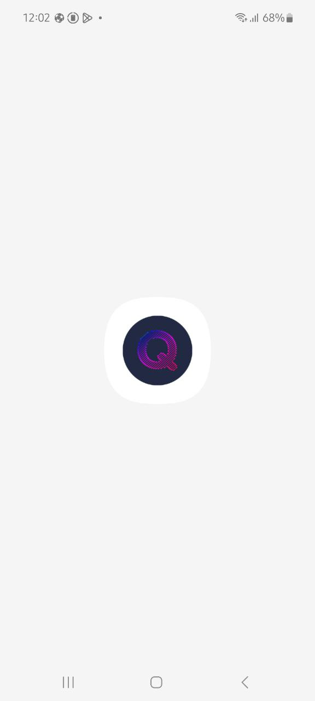
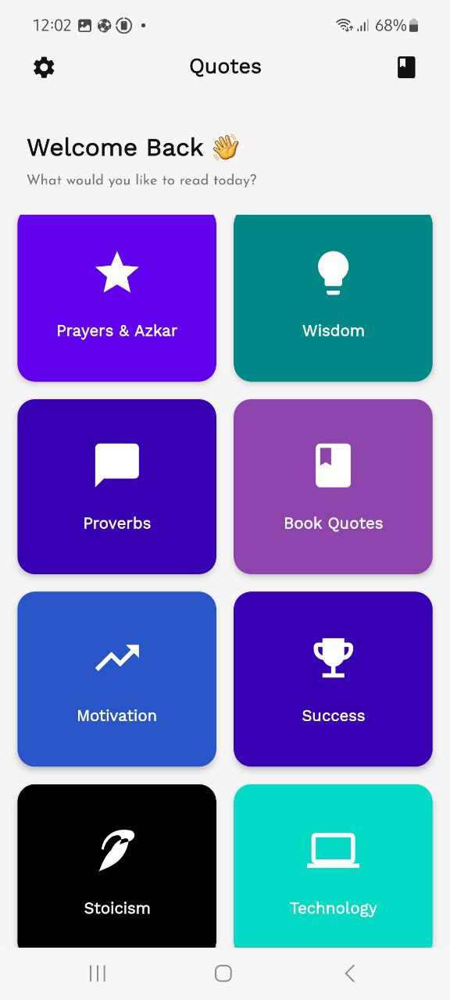
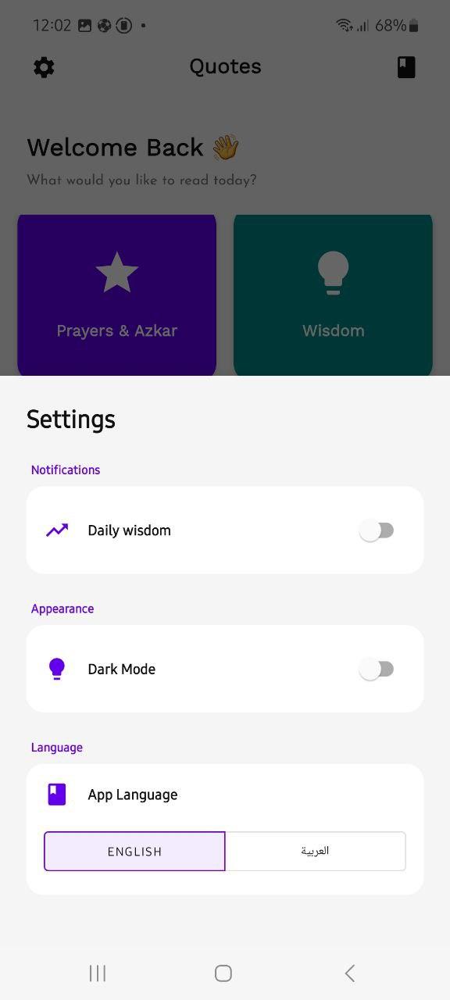
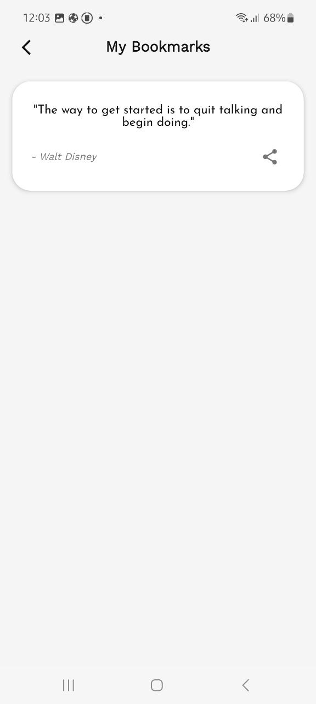
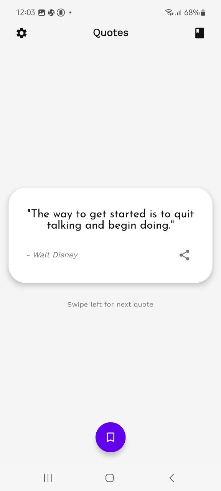
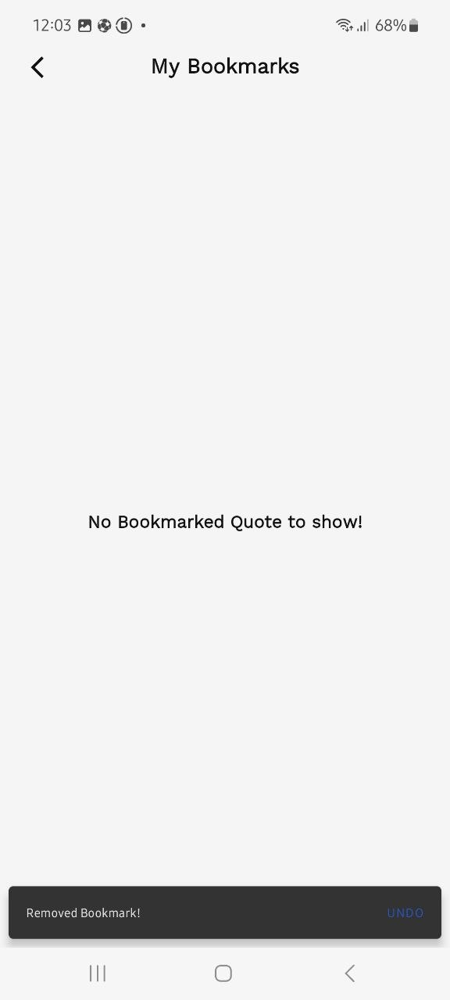
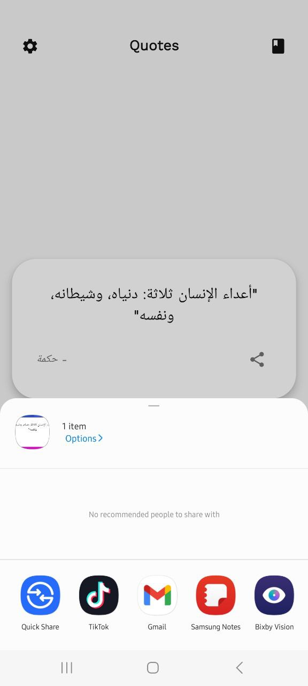

# ❝ Quotes App

A modern, feature-rich Android application designed to provide daily inspiration through a vast collection of quotes. Built using **Modern Android Development (MAD)** practices, this app demonstrates a clean architecture, robust offline capabilities, and a polished user interface.

The app supports **Dark/Light modes** and **Arabic/English localization**, ensuring a personalized user experience.

---

## 📸 Screenshots

| | | |
|:---:|:---:|:---:|
|  |  |  |
|  |  |  |
|  |  |  |
| 

---

## ✨ Key Features

* **📖 Categorized Quotes:** Browse quotes by categories (Wisdom, Technology, Motivation, etc.).
* **💾 Offline Bookmarks:** Save your favorite quotes locally to view them anytime without internet access.
* **🔔 Daily Notifications:** Receive a "Quote of the Day" notification every morning using background workers.
* **🎨 Dynamic Theming:** Full support for **Light** and **Dark** modes with dynamic color adjustments.
* **🌍 Localization:** Seamless switching between **English** and **Arabic** languages within the app.
* **🚀 Smooth Animations:** Engaging Lottie animations for the splash screen and UI transitions.
* **📤 Share & Copy:** Easily share quotes as text or images with friends.

---

## 🛠 Tech Stack & Libraries

This project follows the **MVVM (Model-View-ViewModel)** architecture pattern to ensure separation of concerns and testability.

| Technology | Purpose & Why it was used |
| :--- | :--- |
| **Kotlin** | The primary language, chosen for its conciseness, null safety features, and interoperability with Java. |
| **MVVM Architecture** | To separate the UI (Activity/Fragments) from the business logic (ViewModels) and data (Repository), making the code cleaner and easier to maintain. |
| **Dagger Hilt** | For **Dependency Injection**. It reduces boilerplate code for manual dependency injection and makes managing app-wide components (like DB instances) efficient. |
| **Coroutines & Flow** | For handling asynchronous tasks (like DB operations) and reactive data streams without blocking the main thread, ensuring a smooth UI. |
| **Room Database** | A robust abstraction layer over SQLite. Used to cache quotes and store user bookmarks locally for offline access. |
| **Jetpack Navigation** | Used to implement a **Single Activity Architecture**, simplifying navigation between fragments and handling back-stack operations. |
| **WorkManager** | To schedule reliable background tasks (Daily Notifications) that run even if the app is closed or the device restarts. |
| **DataStore** | A modern replacement for SharedPreferences to store user preferences (e.g., selected Theme, Language, Notification settings) asynchronously. |
| **ViewBinding** | To safely interact with XML views, eliminating `findViewById` and preventing NullPointerExceptions. |
| **Lottie Animations** | To render high-quality vector animations (Splash Screen) that are lightweight and performant. |
| **Material Design** | To provide a modern, aesthetically pleasing UI with standard components like Cards, Floating Action Buttons, and Bottom Sheets. |

---

## 🏗 Architecture Overview

The app is structured into three main layers:

1.  **UI Layer (View):** Fragments and Activities that observe data from the ViewModel. They handle user interactions and display the state.
2.  **Domain/Presentation Layer (ViewModel):** Holds the UI state and exposes data via `StateFlow` or `LiveData`. It acts as a bridge between the UI and the Repository.
3.  **Data Layer (Repository & Data Source):**
    * **Repository:** The single source of truth. It decides whether to fetch data from the local database (Room) or remote sources.
    * **Local Data Source:** Room Database (DAO) and DataStore.

---

## 👤 Author

**[Eslam Ali Atta]**

* **LinkedIn:** [https://www.linkedin.com/in/eslam-ali-b0b874195/]
* **Email:** [eslameng776@gmail.com]

---
